R Markodwn 中文模版合集
================

## 适合移动手机浏览 `mobile.Rmd`

## 自定义 R 绘图 `article-zh.Rmd`

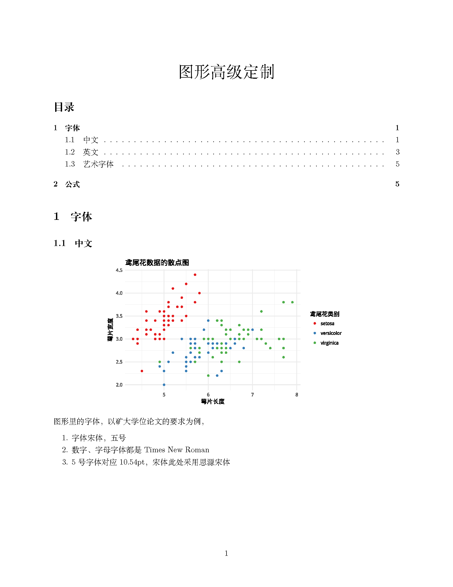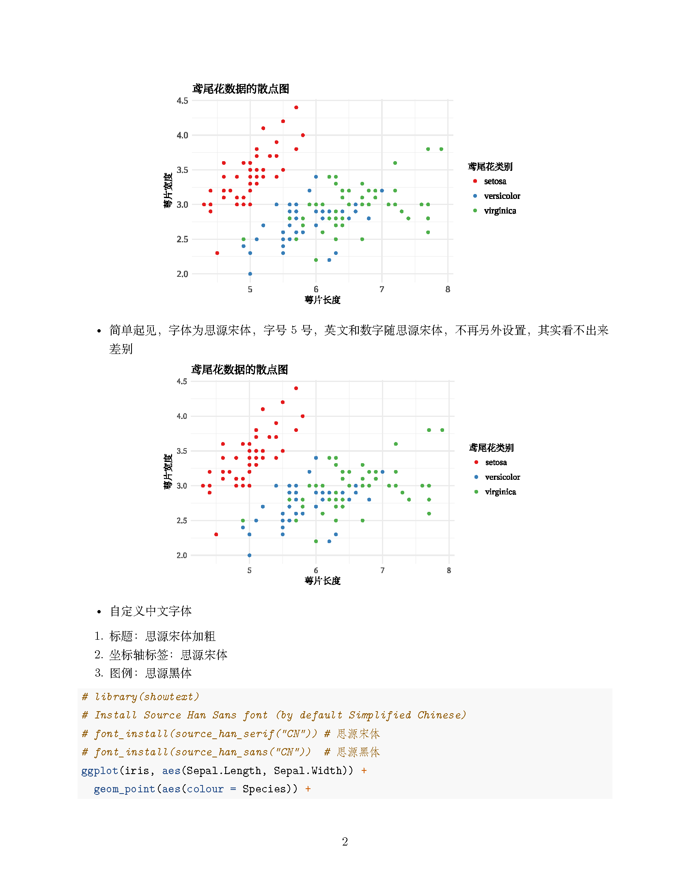

## 使用 `bookdown::pdf_document2` 制作中文模版 `article4report.Rmd`

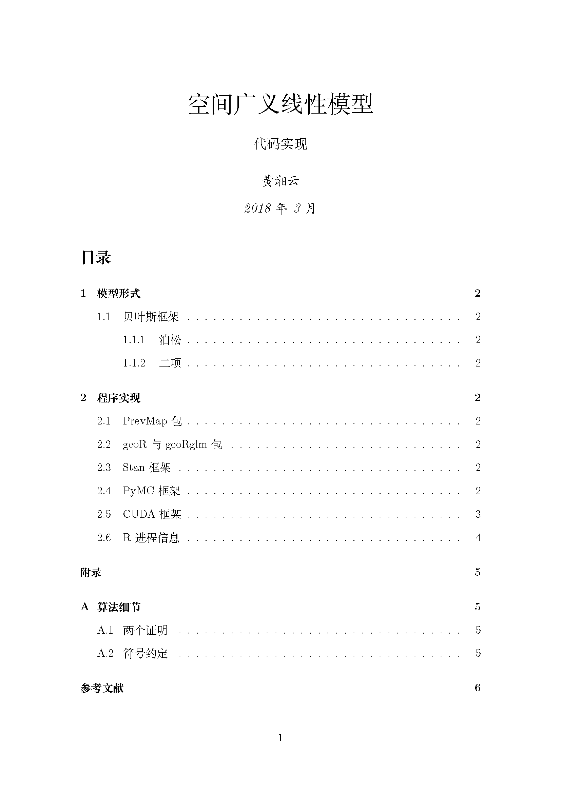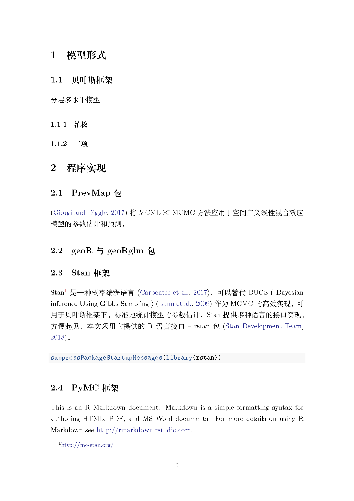

## 使用 `report` 文类制作中文模版 `report-zh.Rmd`

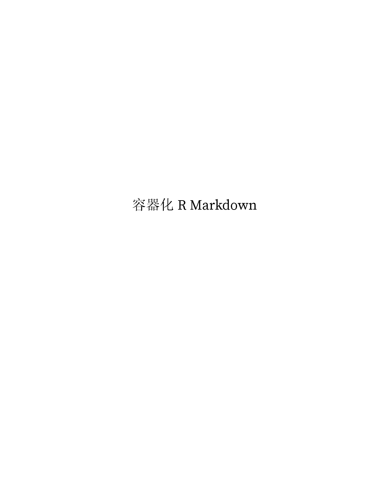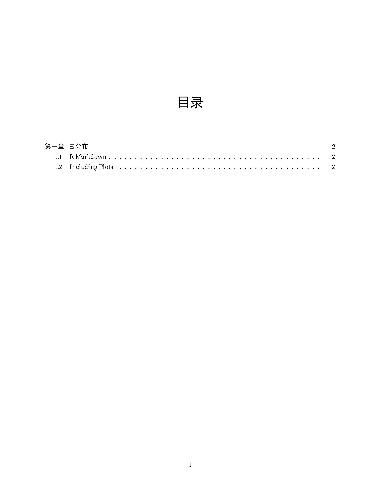

## 使用 `rticles::ctex` 的中文模版 `rticles.Rmd`

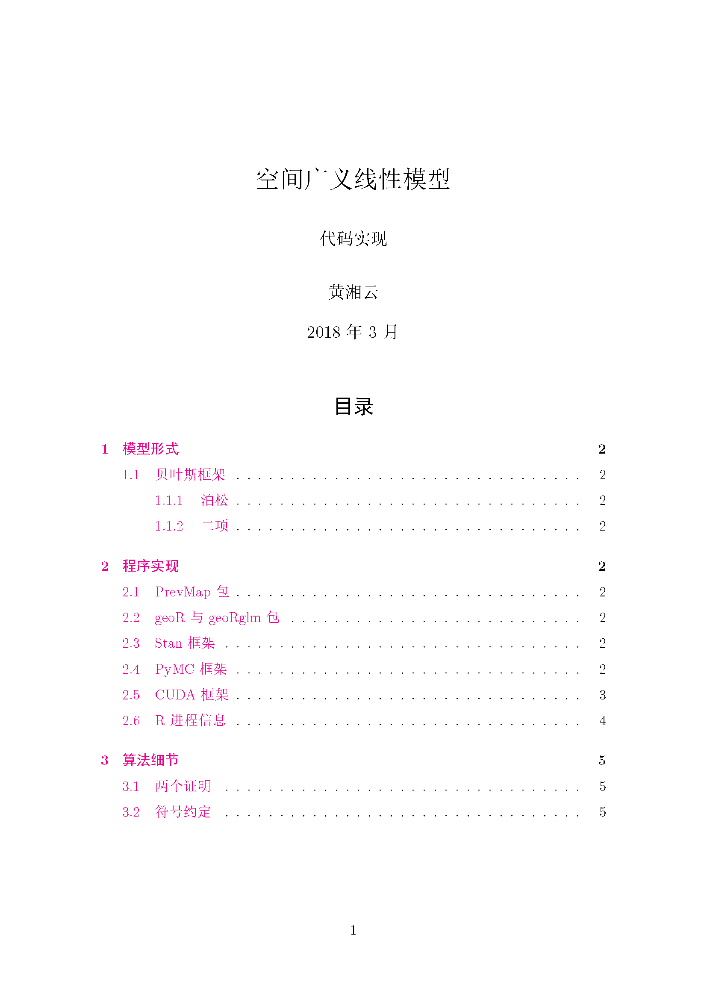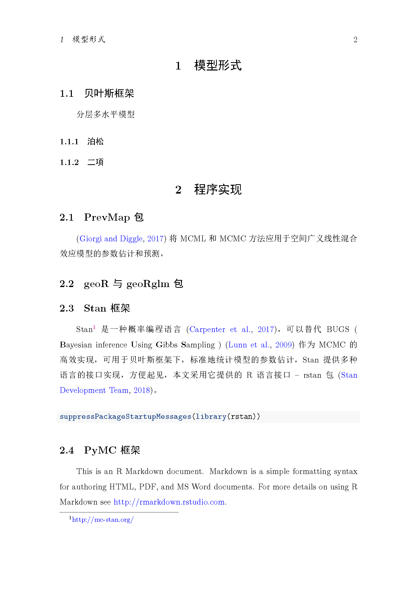

## 支持 TikZ 的中文模版 `TikZ.Rmd`

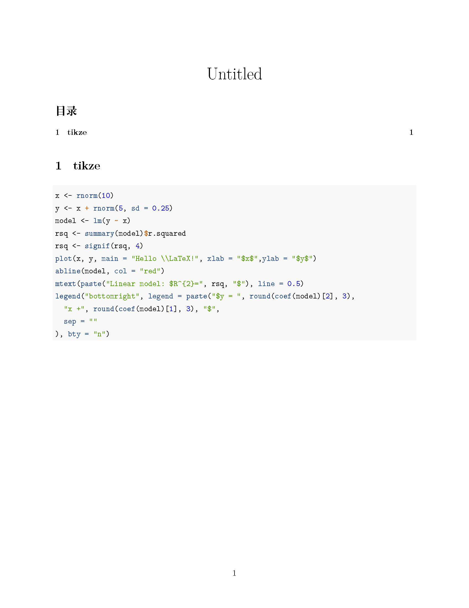

## 自定义全文字体模版 `template.Rmd`

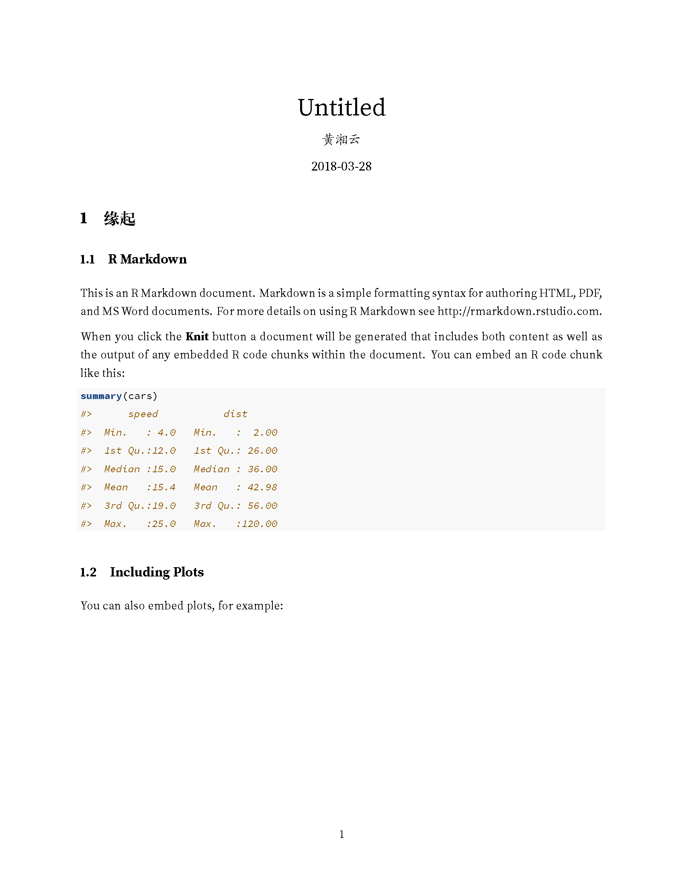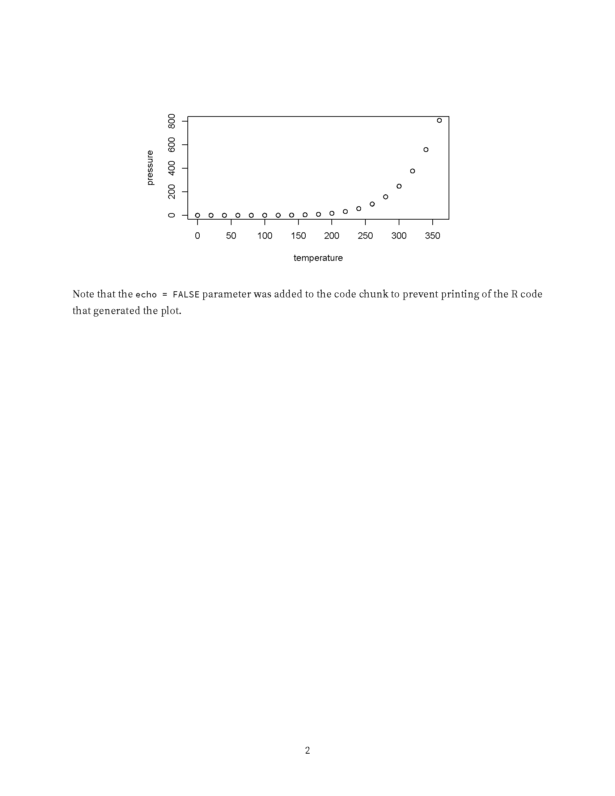

## 双栏排版中文模版 `twocol-zh.Rmd`

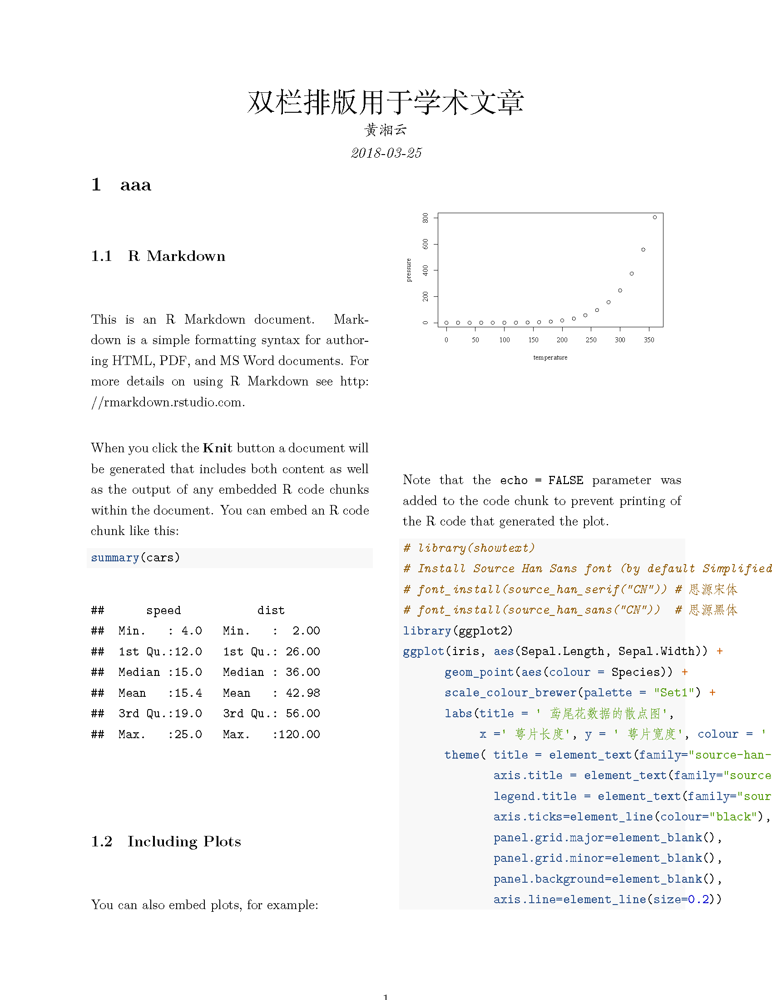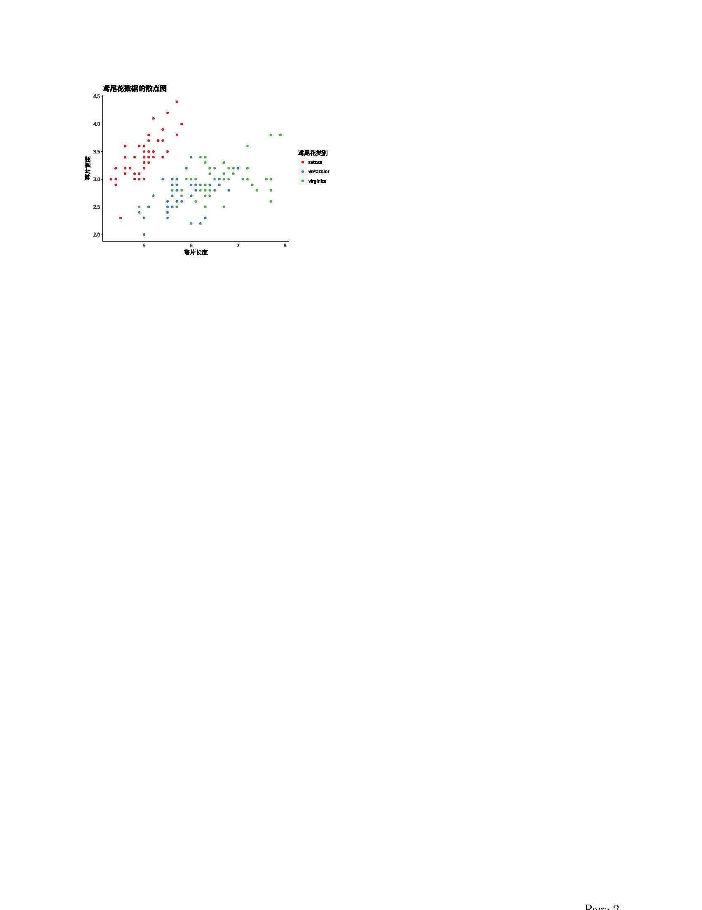
